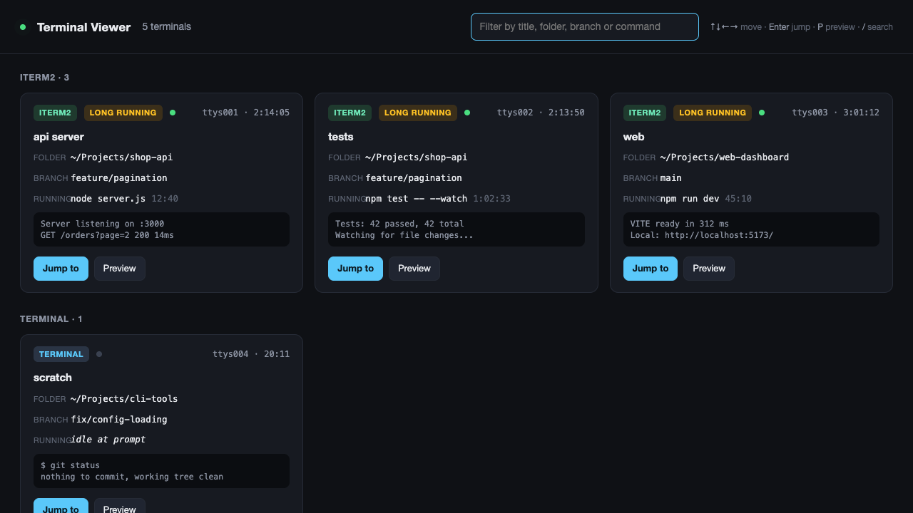

# Terminal Viewer

A local dashboard of every terminal open on your Mac, for developers who keep many tabs and lose track of them.



## Features

- Lists Terminal.app tabs, iTerm2 sessions and VS Code integrated terminals in one page
- Shows folder, git branch, running command and uptime for each terminal
- Card previews the last two lines of the screen; a card flashes when its command changes
- "Long running" badge after five minutes
- Jump-to button focuses the tab
- Preview drawer with scrollback and a command bar to send a line to a terminal or interrupt with Ctrl+C (iTerm2 only)
- Keyboard: arrow keys move, Enter jumps, P previews, / filters, Escape closes

## Tech stack

Node.js (no dependencies), AppleScript via `osascript`, `ps` and `lsof`, plain HTML and JavaScript frontend.

## Quick start

```
git clone https://github.com/devumang096/terminal-viewer.git
cd terminal-viewer
npm start            # add -- --no-open to skip opening the browser
```

Opens http://localhost:4488. Requires Node 20+.

## How it works

The server polls `ps` for shells attached to a tty, reads each shell's working directory with `lsof`, and asks Terminal.app and iTerm2 for tab titles and screen contents through AppleScript. It matches the two by tty. It listens on 127.0.0.1 only and rejects requests with a foreign Host or Origin header, because the command bar types into real terminals.

## Limitations

- macOS only
- macOS asks once whether node may control Terminal and iTerm2. Allow it, or titles, busy state, preview and Jump-to will not work
- iTerm2 exposes only the visible screen, so its preview is the current screen
- VS Code terminals show folder and command only, and Jump-to raises the window with that folder, not the exact panel

## Tests

```
npm test
```

## License

MIT
